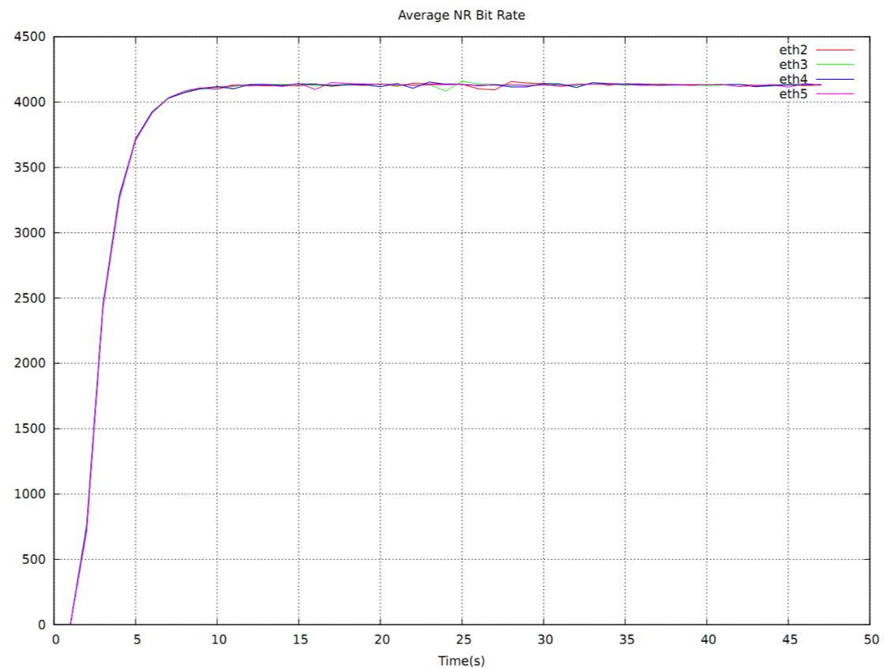
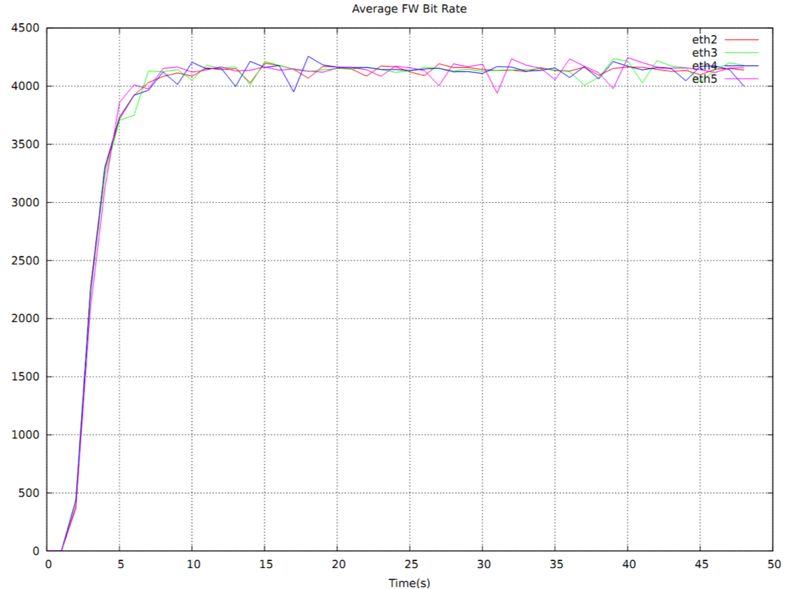
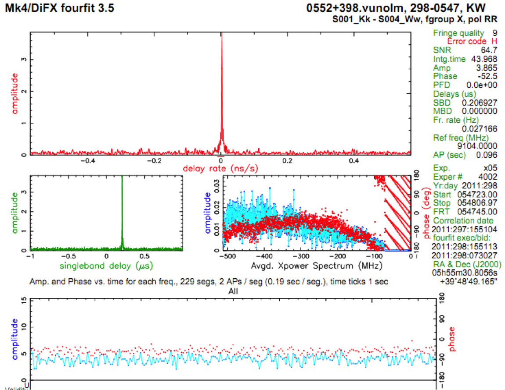

Demonstrations
==============

On Monday, October 24th, 2011 the first 16 Gbps VLBI experiment was conducted
using two development Mark 6 systems: one located at the `Westford <http://www.haystack.mit.edu/obs/westford/history.html>`_ Radio Telescope in Massachusetts, and the other located at the 12m `Goddard Geophysical and Astronomical Observatory (GGAO) <http://cddis.nasa.gov/ggao/>`_ Radio Telescope in Greenbelt, MD.

Data were captured over the course of an R1 experiment, then transferred
to Haystack for correlation on the Haystack Software Correlator.
Figures 1 through 3 summarize the key results of the 16 Gbps demonstration.

  **Figure 1:** Average receive bit rate versus time for each of the four
  10 GE interfaces on the Mark6 VDAS. Each interface maintains
  4 Gbps for the duration fo the 43 second scan.

  **Figure 2:** Average write bit rate versus time for each of the four
  8-disk modules on the Mark6 VDAS. Each interface maintains
  4 Gbps for the duration fo the 43 second scan.

  **Figure 3:** Final (successful) correlation results for a single
  500 MHz channel.

